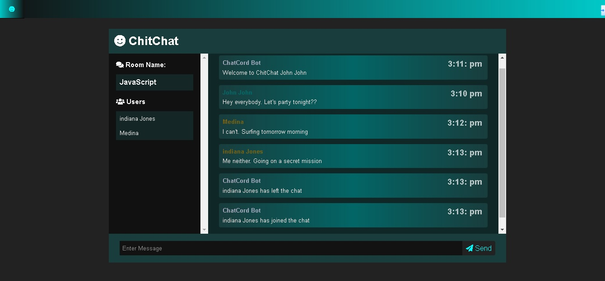
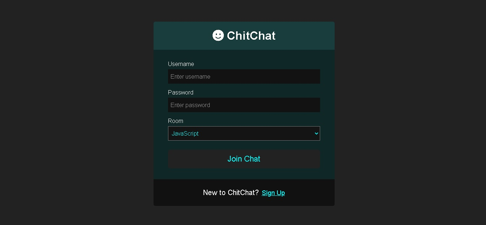
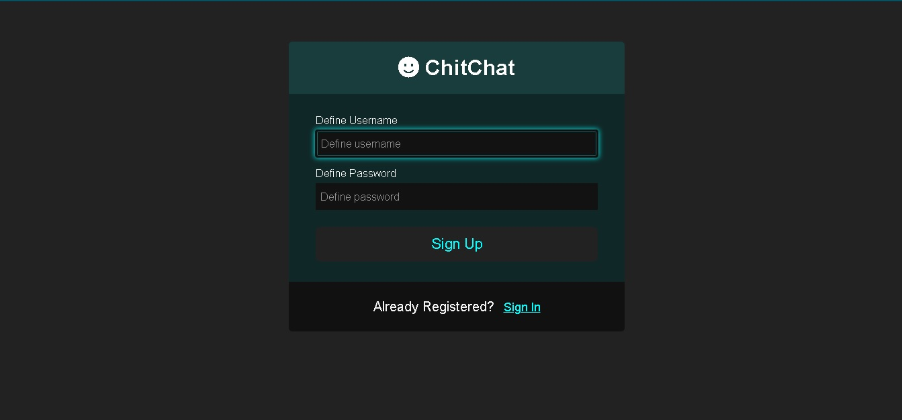

# ChitChat

## Table of contents

- [Overview](#overview)
  - [Users should be able to](#users-should-be-able-to)
  - [Screenshot](#screenshot)
  - [Built with](#built-with)
- [Author](#author)
- [Acknowledgments](#acknowledgments)

## Overview

### Users should be able to:

- Register
- Sign in
- Join any room of his choice after the log in is successful
- See all previous and current messages from that room
- Know when another user enters/leaves the same room

### Screenshot

## Built with

Chitchat is a Realtime Chat App made basically using Node.js, Express and Socket.IO

## Author

- Website - [Iago D. de Oliveira Marques](https://chat-teste1.herokuapp.com/)

## Acknowledgments

This project did not start from scratch. I found it on Youtube.
- The Link to the video - (https://www.youtube.com/watch?v=jD7FnbI76Hg)

